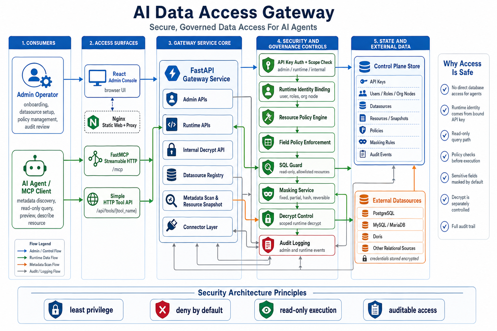
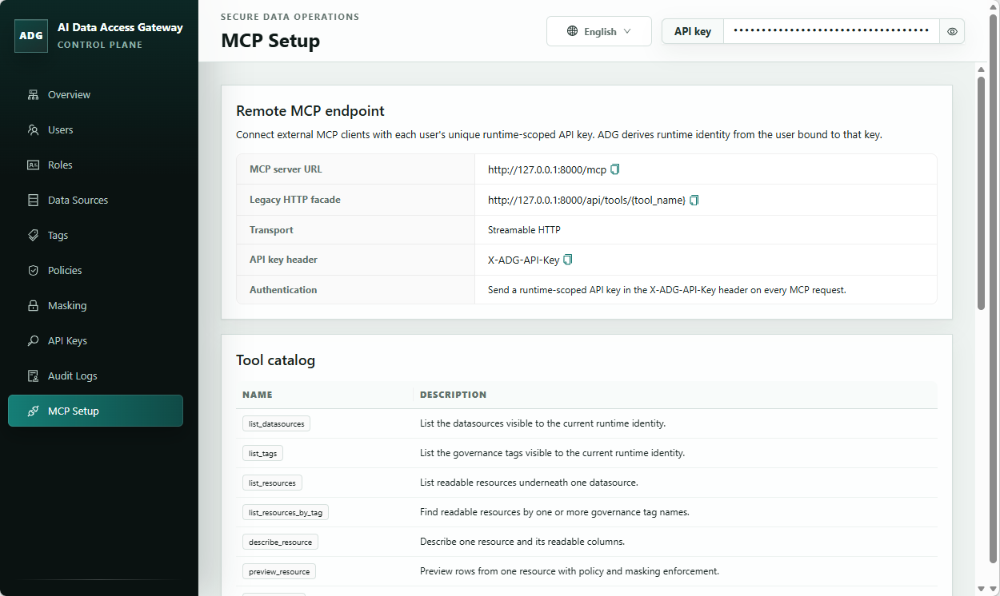

# AI Data Access Gateway

[中文版 README](docs/zh-CN/README.md)

AI Data Access Gateway is an open-source secure data access gateway for AI agents. It provides database safety access services to AI agents through the MCP protocol. It sits between AI agents and real data sources, exposes governed metadata discovery and read-only data access, and enforces authorization, SQL safety checks, field-level policies, masking, data decrypt controls, and audit logging during AI-initiated data queries.

## Architecture Overview

The project consists of a data security access layer and an admin console.

The runtime data access layer uses SQL Guard, resource policies, and field policies to constrain queries to controlled read-only paths. Resource policies can target data sources, databases, schemas, tables or views, tags, or global scope; field and masking policies remain field-level controls. It exposes both a FastMCP Streamable HTTP `/mcp` endpoint and a simpler `/api/tools/{tool_name}` HTTP tool API.

The admin console serves a single-admin trust model. It covers data source maintenance, resource governance, and audit review, and manages data source registration, directory identity mapping, resource metadata, field policies, masking configuration, API Key management, and enterprise organization structure management.

The repository also includes demo data initialization, Docker Compose startup, and minimal runtime HTTP call examples.



## Admin UI Example



## Repository Layout

- `src/adg/`: backend application code, control plane, runtime, connectors, and security capabilities
- `tests/`: backend unit and integration coverage
- `web/`: React + Vite admin console
- `examples/`: demo seed data and example client flows
- `docs/`: internal planning, design, acceptance, and repository memory docs

## Quickstart

Prefer Docker Compose for a production-style runtime stack. If you run directly on the host, use non-development dependencies, keep reload disabled, and set production environment variables explicitly.

### Backend

```powershell
uv sync --frozen --no-dev --extra all
$env:ADG_ENV="production"
$env:ADG_CONTROL_PLANE_DATABASE_URL="sqlite:///./data/adg-control-plane.db"
$env:ADG_SECRET_KEY="<generate-a-long-random-secret>"
$env:ADG_CREDENTIAL_ENCRYPTION_KEY="<generate-a-second-long-random-secret>"
uv run --no-dev --extra all alembic upgrade head
uv run --no-dev --extra all init-admin --database-url sqlite:///./data/adg-control-plane.db
uv run --no-dev --extra all uvicorn adg.app.main:create_app --factory --host 0.0.0.0 --port 8000
```

`init-admin` prints a one-time admin API key for console onboarding and admin setup. Save it immediately and use it in the console. Runtime HTTP examples require a separate runtime-scoped API key bound to a directory user; create or reset that key after initialization.

### Frontend

```powershell
Set-Location web
npm ci
npm run build
```

The production build is written to `web/dist`. The Docker Compose path serves this static frontend with Nginx and exposes the web console at `http://127.0.0.1:8080`.

### Docker Compose

```powershell
Copy-Item docker-compose.example.yml docker-compose.yml
$env:ADG_SECRET_KEY="<generate-a-long-random-secret>"
$env:ADG_CREDENTIAL_ENCRYPTION_KEY="<generate-a-second-long-random-secret>"
docker compose up --build
docker compose exec backend init-admin
```

`docker-compose.example.yml` is the tracked template. Copy it to `docker-compose.yml` for local deployment changes, then edit the copied file for ports, volumes, or environment-specific settings. To build with package mirrors, set `PYPI_INDEX_URL` and/or `NPM_REGISTRY_URL` in `.env`; if they are omitted, the Docker build uses `https://pypi.org/simple` and `https://registry.npmjs.org/`. The Compose stack starts production backend and static frontend containers. The backend API and MCP endpoints are published at `http://127.0.0.1:8000` by default; set `ADG_BACKEND_HOST_PORT` in `.env` if AI agents need a different host port. The admin console uses `ADG_BACKEND_HOST_PORT` when showing MCP connection URLs, and only omits the port for `80` or `443`. The web console is published at `http://127.0.0.1:8080` by default; set `ADG_WEB_PORT` if that host port is already allocated. Set `ADG_BACKEND_PORT` only when you need to change the backend container's internal listen port. SQL guard behavior is split into execution mode and strict validation: `ADG_SQL_EXECUTION_MODE` defaults to `read_only` and may be set to `dml`, `schema`, or `admin` for broader statement categories, while `ADG_SQL_STRICT_VALIDATION` defaults to `true` for function and projection restrictions. Runtime datasource queries reuse SQLAlchemy engines through an in-process LRU/idle-TTL cache. Tune it with `ADG_RUNTIME_DATASOURCE_POOL_CACHE_SIZE` (default `32`), `ADG_RUNTIME_DATASOURCE_POOL_IDLE_TTL_SECONDS` (default `300`), `ADG_RUNTIME_DATASOURCE_POOL_SIZE` (default `5`), and `ADG_RUNTIME_DATASOURCE_POOL_MAX_OVERFLOW` (default `0`). Runtime query connections also set DBAPI timeouts with `ADG_RUNTIME_DATASOURCE_CONNECT_TIMEOUT_SECONDS` (default `10`), `ADG_RUNTIME_DATASOURCE_READ_TIMEOUT_SECONDS` (default `120`, MySQL/Doris), and `ADG_RUNTIME_DATASOURCE_WRITE_TIMEOUT_SECONDS` (default `120`, MySQL/Doris).

## Contributor Verification

```powershell
uv sync --extra dev --extra all
uv run --extra dev pytest
uv run --extra dev ruff check .
uv run --extra dev mypy src tests
Set-Location web
npm test
npm run build
npm run audit:prod
Set-Location ..
uv export --frozen --extra dev --extra all --no-editable --no-hashes --no-emit-project --format requirements-txt --output-file .tmp-audit-requirements.txt
uv tool run --from pip-audit pip-audit -r .tmp-audit-requirements.txt --no-deps --vulnerability-service osv --progress-spinner off
Remove-Item .tmp-audit-requirements.txt
```

## Documentation

- [Chinese README](docs/zh-CN/README.md)
- [Security Policy](SECURITY.md)
- [Contributing](CONTRIBUTING.md)
- [Code of Conduct](CODE_OF_CONDUCT.md)

## License

This project is licensed under Apache 2.0. See [LICENSE](LICENSE).
