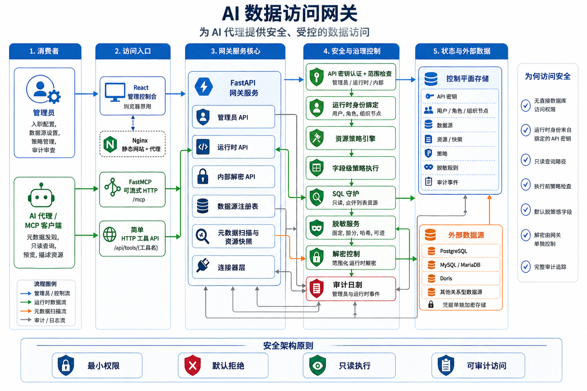
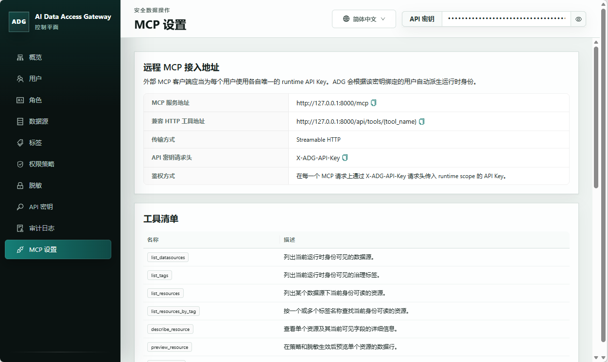

# AI Data Access Gateway

[English README](../../README.md)

AI Data Access Gateway 是一个面向 AI Agent 的开源安全数据访问网关，通过 MCP 协议为 AI Agent 提供数据库安全访问服务。它位于 AI Agent 与真实数据源之间，提供受管控的元数据发现与只读数据访问，并在 AI 发起的数据查询过程中执行鉴权、SQL 安全检查、字段级策略、脱敏、数据解密控制并记录审计日志。

## 架构概览

项目由数据安全访问层和管理控制台组成。

运行时数据访问层通过 SQL Guard、资源策略和字段策略限制查询，只允许受控的只读路径，并同时暴露 FastMCP Streamable HTTP `/mcp` 端点与更简单的 `/api/tools/{tool_name}` HTTP 工具接口；

管理控制台为单管理员信任模型服务，覆盖数据源维护、资源治理与审计查看等操作，负责数据源登记、目录身份映射、资源元数据、字段策略、脱敏配置与 API Key 管理、企业组织架构管理。

仓库还包含演示数据初始化、Docker Compose 启动方式，以及最小化的运行时 HTTP 调用示例。



## 管理界面示例



## 仓库布局

- `src/adg/`：后端应用、控制平面、运行时、连接器与安全能力
- `tests/`：后端单元与集成测试
- `web/`：React + Vite 管理控制台
- `examples/`：演示种子数据和示例客户端流程
- `docs/`：内部规划、设计、验收与仓库记忆文档

## 快速开始

推荐优先使用 Docker Compose 启动生产式运行栈；如果需要在宿主机上直接运行，也请使用非开发依赖、关闭 reload，并显式设置生产环境变量。

### 后端

```powershell
uv sync --frozen --no-dev --extra all
$env:ADG_ENV="production"
$env:ADG_CONTROL_PLANE_DATABASE_URL="sqlite:///./data/adg-control-plane.db"
$env:ADG_SECRET_KEY="<generate-a-long-random-secret>"
$env:ADG_CREDENTIAL_ENCRYPTION_KEY="<generate-a-second-long-random-secret>"
uv run --no-dev --extra all alembic upgrade head
uv run --no-dev --extra all init-admin --database-url sqlite:///./data/adg-control-plane.db
uv run --no-dev --extra all uvicorn adg.app.main:create_app --factory --host 0.0.0.0 --port 8000
```

`init-admin` 会输出一次性的管理员 API Key，用于控制台初始化和管理面配置。请立即保存，并在控制台中使用该值。运行时 HTTP 示例需要另一个绑定目录用户的 runtime 作用域 API Key，该 Key 需要在初始化完成后单独创建或重置。

### 前端

```powershell
Set-Location web
npm ci
npm run build
```

生产构建产物会输出到 `web/dist`。Docker Compose 方案会使用 Nginx 托管该静态前端，并将 Web 控制台暴露在 `http://127.0.0.1:8080`。

### Docker Compose

```powershell
Copy-Item docker-compose.example.yml docker-compose.yml
$env:ADG_SECRET_KEY="<generate-a-long-random-secret>"
$env:ADG_CREDENTIAL_ENCRYPTION_KEY="<generate-a-second-long-random-secret>"
docker compose up --build
docker compose exec backend init-admin
```

`docker-compose.example.yml` 是纳入版本控制的模板文件。请先复制为 `docker-compose.yml`，再在复制出来的文件里调整端口、卷挂载或环境相关配置。如需使用包镜像源，请在 `.env` 中设置 `PYPI_INDEX_URL` 和/或 `NPM_REGISTRY_URL`；如果未设置，Docker 构建会使用 `https://pypi.org/simple` 和 `https://registry.npmjs.org/`。Compose 方案会启动生产环境的后端与静态前端容器，其中 Web 控制台默认暴露在 `http://127.0.0.1:8080`。

## 贡献者验证命令

```powershell
uv sync --extra dev --extra all
uv run --extra dev pytest
uv run --extra dev ruff check .
uv run --extra dev mypy src tests
Set-Location web
npm test
npm run build
npm run audit:prod
Set-Location ..
uv export --frozen --extra dev --extra all --no-editable --no-hashes --no-emit-project --format requirements-txt --output-file .tmp-audit-requirements.txt
uv tool run --from pip-audit pip-audit -r .tmp-audit-requirements.txt
Remove-Item .tmp-audit-requirements.txt
```

## 文档导航

- [安全策略镜像](security.md)
- [贡献指南镜像](contributing.md)
- [行为准则镜像](code-of-conduct.md)
- [English README](../../README.md)
- [English Security Policy](../../SECURITY.md)
- [English Contributing](../../CONTRIBUTING.md)
- [English Code Of Conduct](../../CODE_OF_CONDUCT.md)

## 许可证

项目采用 Apache 2.0 许可证。详情见 [LICENSE](../../LICENSE)。
